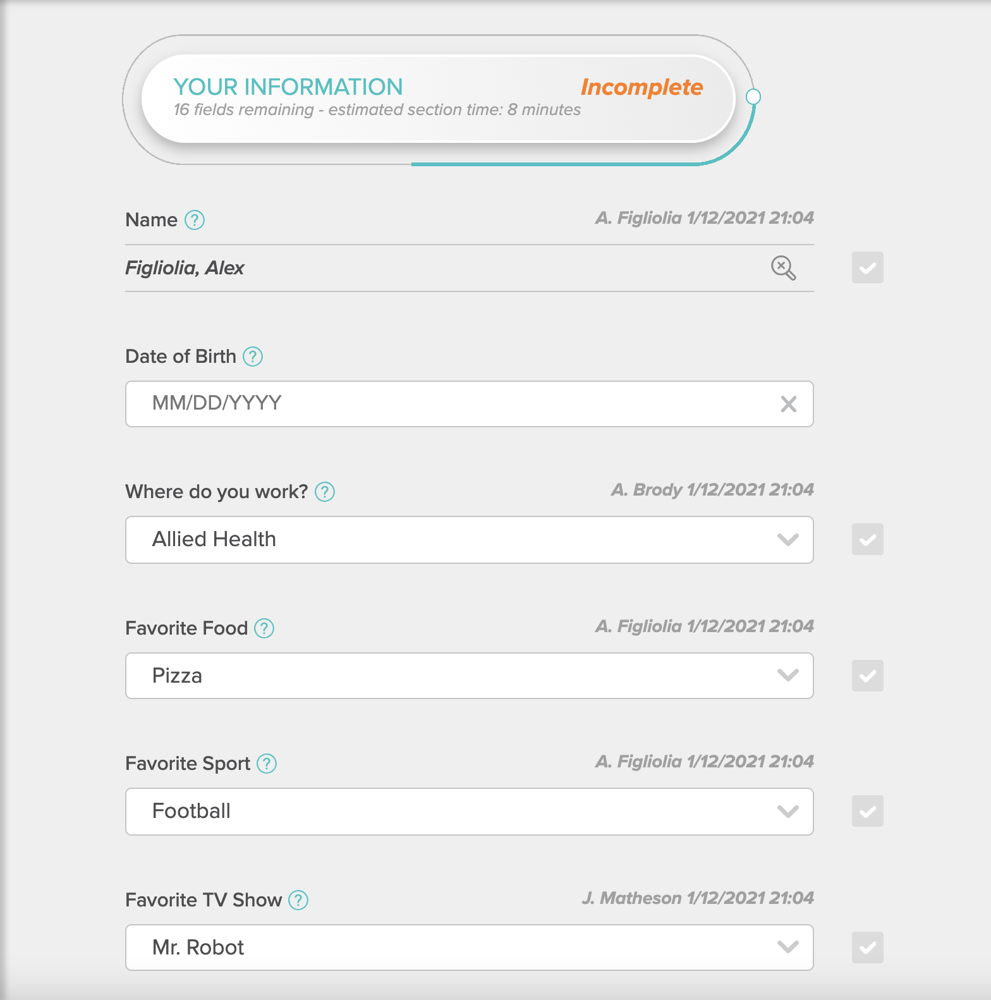

## Dynamic Forms:
The goal of this exercise is to create a feature-rich dynamic form using React
___

**The following is a spec checklist for our desired functionality:**

- [ ] Render a form with the following features using the data (data.js) provided and **React.js**
- [ ] You may scaffold out a project using **webpack** or **create-react-app**
- [ ] The form should have two labeled sections (**Full Name** and **Home Address**)
- [ ] Inside each section, please render an input for **each** of the array indices using only the data provided
- [ ] Create masks to validate against provided regexes if necessary
- [ ] Inputs with a **dependencies** key should only be visible if all of the **dependency keys** resolve to true. The format of the **dependencies** object is as follows: 
    ```
    dependencies: { 
      [id_of_a_preceding_field (Ex: FirstName)]: value_or_conditional //ex: True | value => !!value
    }
- [ ] Inputs with a **sourceList** parameter must limit it's value to only the choices within the **sourceList** provided
- [ ] Track the progress of your users by tallying the total completed inputs against the total of incomplete inputs

**A few things to keep in mind during this exercise:**
1. Make your form look however you like - some fun designs can be found here: https://tympanus.net/Development/TextInputEffects/index2.html
2. If you like to use cutting edge features make sure to polyfill JavaScript that is not ready for production
3. Consider performance - imagine this form had thousands of fields - Can you think of ways to retain performance and limit wasteful rendering?
4. If there's a feature you'd like to add to your form - not supported by the provided data - feel free to add it
5. Beautiful forms get bonus points



